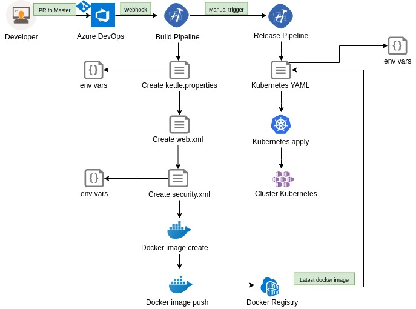

## Pentaho webspoon configuration

The image used in docker multistage refers to an existing Hiromu Hota project [link here](https://github.com/HiromuHota/webspoon-docker)

#### Project Files and Directories:
1. PentahoFiles: Directory to put all * .ktr and * .kjb. Facilitating a CI / CD process, where you would only have to commit those files into a git repository.

2. plugins: Being able to put any current need plugin, in my case I used the sqljdbc plugin, in case you need to create your * .ktr while maintaining connection to a database.

3. Dockerfile: Dockerfile with docker multistage for creating the webspoon container.

4. kettle.properties: If you need to configure * .ktr with environment variables.

5. web.xml: To enable authentication (local or per ldap).

6. security.xml: Configure the local or ldap authentication type with server, protocol, user, and password data, if applicable.

#### Image Build
This process is quite time consuming as it downloads the pentaho-di which contains a bit more than 1.1GB. I used docker multistage to remove unnecessary plugins (which made sense at the moment for me), also using a tomcat alpine image for this. All of this can be placed on a CI / CD treadmill. In this repository, I left a drawing of a complete treadmill using Azure DevOps, with deploy in a kubernetes cluster, but still needs improvements in the build process, as well as create pipeline as code.


 

```shell
$ docker build -t pentahowebspoon: latest.
```

#### Container Creation
```shell
$ docker run -d -p 8080: 8080 pentahowebspoon: latest
```

#### Open spoon via browser
http://0.0.0.0:8080/spoon/spoon

#### Thanks

Thanks to [Hiromu Hota](https://github.com/HiromuHota) for contributing in the community, and having the repository with pentaho webspoon with image ready in the docker hub, facilitating for me an occasional need to use pentaho webspoon.